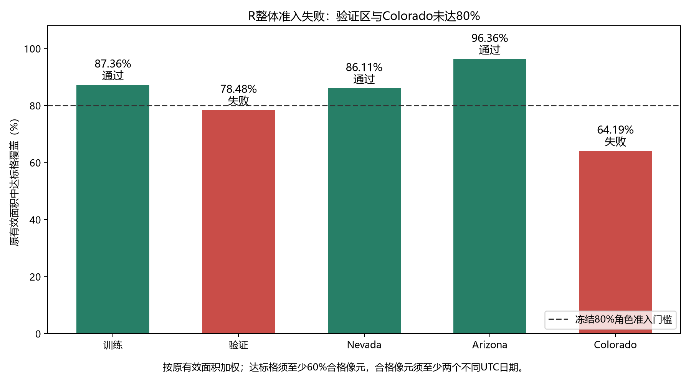

# 矿产记录的空间补全：阶段研究进展

本科科研探索 · 软件工程 · 更新于 2026 年 10 月 6 日

本项目研究：**地图上一部分区域的矿产登记记录被隐藏后，能否利用已知记录和地质资料恢复其空间分布？复杂模型的收益能否超过简单的空间聚集规律？**

本仓库用于与导师交流研究进展，包含问题定义、阶段结果、实验方法和待讨论事项。已有实验的任务是人工隐藏条件下的**已登记记录补全**；未登记不等于无矿，恢复记录也不等于发现新矿床。新增方向讨论拟从露头验证的岩性与蚀变分析出发，逐步考虑构造、物探与钻探靶区，尚未形成正式实验协议。

## 最新方向讨论：先核实岩性与勘查数据

10 月 4 日的方向讨论提出：先用露头资料验证地表岩性与蚀变表示，再考虑构造和物探融合；只有真实地下资料与完整历史钻孔具备时，才讨论有限候选孔及见矿概率评价。

目前完成的是背景学习、分阶段方案和数据需求整理。具体矿区、矿床类型、同区数据覆盖、历史钻孔及见矿成功定义仍**待核实**；没有新高光谱/物探数据验收、正式训练或钻孔评价结果。现有 Sentinel-2 六波段统计属于多光谱，不能写成已有高光谱成果，旧 2 km 排序也不能转换为钻孔成功概率。

详见[岩性约束靶区方向讨论](docs/lithology-drilling-plan.md)。当前成果限于问题定义与资料需求，旧冻结协议与科学结论保持。

## 已有数据阶段：地质通过，遥感覆盖未通过

截至 2026 年 10 月 3 日，固定 27 图块的多模态数据阶段已完成处理与阶段复核：新版地质 G 的五个分区均达到 90% 覆盖门槛；遥感 R 的验证区覆盖为 **78.481967%**、Colorado 为 **64.186667%**，未达到 80% 门槛。处理程序正常结束，但数据整体未获准进入模型实验。

**本阶段模型资源试跑、正式 U-Net/RF 拟合、预测与科学评价均未执行，没有新的 AP 结果。** 知识表示 K 因指定岩性无法从允许字段可靠映射而未准入；增加第三景的方案仍是未实施的讨论建议。

详见[27 图块多模态数据阶段](docs/multimodal-data-stage.md)。下方模型成绩来自 9 月已完成实验，与新阶段的范围和数据不同。

## 已完成模型实验的认识

棋盘补全实验中，U-Net 超过了最近矿点排序；但地质输入消融和更强空间基线表明，现有结果不足以支持网络整体优于简单空间模型。

- **地质增量尚未体现。** 在相同网络结构与训练规则下，仅矿产模型优于加入当前地质特征的完整模型。这一结论限于现有数据、编码与训练设置。
- **核密度是更强的平均 AP 参照。** 网络在前 5% 面积覆盖率上略有优势，不能因此称所有指标都落后，也不能只用这一指标宣称整体优越。
- **成绩依赖可见上下文。** 白块保留率降至 50% 和 25% 后，网络与核密度的 AP 都下降，网络没有获得稳定的比较优势。

## 历史模型结果：2026 年 9 月 24 日阶段

主条件为 10 km 棋盘、原白块全部保留。对三个地区、金铜两目标等权汇总，网络再对三个随机种子平均。AP 衡量排序质量；前 5% 面积覆盖率表示在得分最高的约 5% 有效评分面积中，覆盖了多少已登记正例网格。

| 方法 | 平均 AP | 前 5% 面积覆盖率 |
|---|---:|---:|
| 面积归一化核密度（5 km） | **0.284779** | 42.20% |
| 仅矿产 U-Net | 0.270143 | **43.07%** |
| 多矿种空间随机森林 | 0.238277 | 41.82% |
| 最近同类矿点排序 | 0.181847 | 36.06% |

相对核密度，网络 AP 低 **5.14%**，前 5% 面积覆盖率高 **0.87 个百分点**。核密度带宽与主要参照由开发验证域选定，没有按本轮评价成绩重选。完整比较和局部差异见[结果说明](docs/results.md)，数字可由[公开聚合表](results/README.md)核对。

## 如何阅读

| 阅读目的 | 材料 |
|---|---|
| 先了解研究问题、结果与待讨论问题 | [研究摘要](docs/research-summary.md) |
| 了解新方向、数据缺项与有条件的钻孔评价 | [岩性约束靶区方向讨论](docs/lithology-drilling-plan.md) |
| 查看新地质与遥感数据的准入、失败和复核边界 | [多模态数据阶段](docs/multimodal-data-stage.md) |
| 查看各阶段做了什么、为何调整方向 | [阶段进展](docs/progress.md) |
| 查看主要结果、上下文减少及案例图 | [结果与图表](docs/results.md) |
| 理解棋盘隐藏、分组、模型和评价 | [实验方法](docs/methods.md) |
| 了解数据来源、尺度与适用边界 | [数据与参考资料](docs/data-and-references.md) |
| 核对数字与公开材料范围 | [复核说明](docs/reproducibility.md) |

## 已完成与下一步

已完成连续空白区距离门控、棋盘补全、地质消融，以及固定网络的强基线与上下文稳健性比较。9月24日模型轮复用 3 份网络权重，新增 2 个正式随机森林模型，汇总 192 份相位预测；该轮没有新增神经网络训练。

已有多模态数据版本保留覆盖失败，候选补景仍未实施。当前优先核实新方向的数据样例、覆盖和标签，明确露头岩性验证与地下钻孔评价的区别，再讨论新任务范围和协议；原失败范围与门槛保持，未来新评价另定支持和验证条件。

三个评价地区已在探索过程中多次查看，当前结果不能作为新的独立地质验证。多个随机种子和遮蔽重复也不增加独立地质样本数。本仓库保留负结果和局部优势，不主张已建立原创算法、地质因果关系或真实找矿能力。

## 仓库范围

这里公开汇报文档、聚合指标、固定案例可视化和精选方法源码。原始记录、逐格预测、分组映射、完整模型权重及内部运行材料保留在本地复核归档中。精选源码用于解释实验实现，**本仓库不是完整的一键训练工程**；公开聚合表可以独立复算报告均值，但不能重建全部逐格指标。

研究参照包括 AAAI 2026 的 [Masked Mineral Modeling](https://ojs.aaai.org/index.php/AAAI/article/view/41252)。本项目没有复现其原论文分数，也不将棋盘遮蔽或空间留出本身作为已确认的新贡献。来源、实现与 AI 辅助说明见[参考资料](docs/data-and-references.md)和[复核说明](docs/reproducibility.md)。
