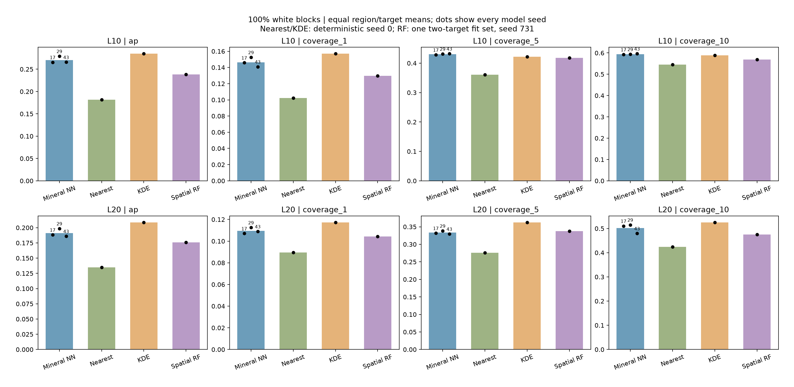
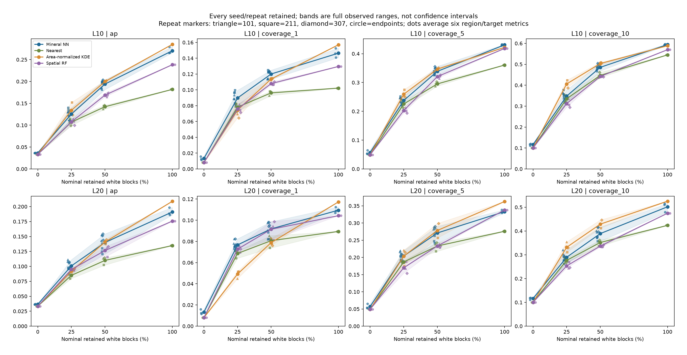
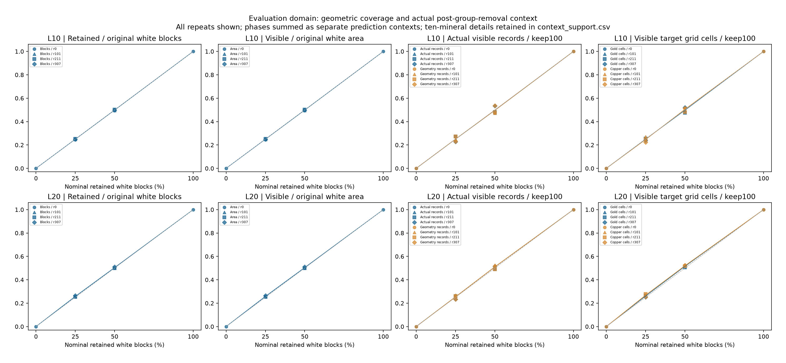
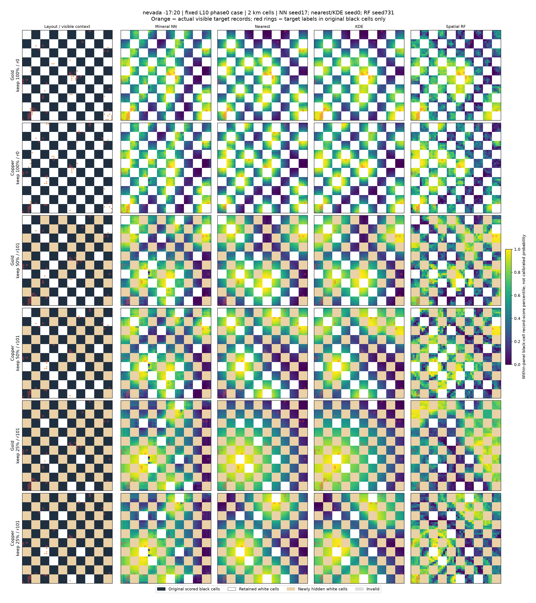

# 结果与图表

更新：2026 年 10 月 4 日。下方五节保留截至9月24日的模型结果，用于阶段方法比较，预测对象均为已登记记录。主条件为 10 km 棋盘、原白块全部保留，20 km 作为补充。详细汇总定义见[实验方法](methods.md)和[表格说明](../results/README.md)。

## 新阶段的结果位置

10月3日新增的是数据覆盖准入结果，尚无模型 AP。G 五分区通过；R 的验证区与 Colorado 未过 80% 门槛，阻止后续联合输入审计与正式拟合。详见[数据阶段专题](multimodal-data-stage.md)和[聚合表及图件](../results/mm-reduced-v1/README.md)。该失败不改变下方历史模型结论，也不能用于判断遥感是否有预测增量。

## 1. 完整上下文：核密度 AP 更高，网络局部面积覆盖略高

| 方法 | 平均 AP | 前 1% 面积覆盖 | 前 5% 面积覆盖 | 前 10% 面积覆盖 |
|---|---:|---:|---:|---:|
| 面积归一化核密度（5 km） | **0.284779** | **15.70%** | 42.20% | 58.86% |
| 仅矿产 U-Net | 0.270143 | 14.64% | **43.07%** | **59.43%** |
| 多矿种空间随机森林 | 0.238277 | 12.96% | 41.82% | 56.97% |
| 最近同类矿点排序 | 0.181847 | 10.22% | 36.06% | 54.50% |

网络减核密度的平均 AP 差为 −0.014636，以核密度为分母的相对差为 −5.14%；前 5% 面积覆盖差为 +0.8739 个百分点。AP 与特定面积预算下的覆盖率关注不同排序区间，方向不同并不矛盾。

三个地区的网络减核密度 AP 差分别为：内华达 +0.019044、亚利桑那 −0.007917、科罗拉多 −0.055034。三个网络种子的整体均值差均为负；18 个种子×地区×矿种配对中，8 项 AP 差为正，12 项前 5% 覆盖差为正。因此应保留局部优势，但不将其替代主比较。

预先约定的继续条件包括相对 AP 提升至少 5%、至少两个地区和两个种子方向为正、前 5% 覆盖不下降。本轮仅最后一项达到。这些条件用于控制后续研究投入，不是统计显著性标准。完整数值见 [summary.json](../results/robustness/summary.json) 和[地区×矿种表](../results/robustness/region_target_performance.csv)。

## 2. 减少可见白块：两种方法都依赖上下文

始终只评价原黑格，额外隐藏的白格不加入评分集合。50% 与 25% 各有三个固定重复；表中先在每个重复内汇总，再等权平均重复。

| 原白块保留率 | 网络平均 AP | 核密度平均 AP | 网络−核密度 AP | 前 5% 覆盖差 |
|---|---:|---:|---:|---:|
| 100% | 0.270143 | 0.284779 | −0.014636 | +0.8739 个百分点 |
| 50% | 0.194085 | 0.199745 | −0.005661 | −0.7582 个百分点 |
| 25% | 0.125642 | 0.134203 | −0.008561 | −2.1722 个百分点 |

50% 下三个重复的 AP 差均为负；25% 下重复 101 略为正（+0.000387），其余为负。两档均未满足预设稳健性筛查条件。名义白块比例不等于精确的有效面积比例或记录保留比例，二者另行统计。

20 km 部分条件存在网络优势，完整保留在[上下文汇总](../results/robustness/context_summary.csv)和[方法实例表](../results/robustness/model_repeat_performance.csv)中，但没有用它替换 10 km 主条件。0% 作为压力诊断：网络仍保留有效域及模型偏置，非恒定输出不表示没有已知矿产时仍具备真实找矿能力。

## 3. 为什么后续固定仅矿产模型

在之前的地质消融中，完整模型和仅矿产模型使用相同网络结构与训练规则。10 km 完整模型 AP 为 0.220731，仅矿产模型为 0.270143；“完整−仅矿产”的相对 AP 差为 −18.29%，前 5% 面积覆盖下降 5.17 个百分点。结果支持继续检查地质资料的尺度、表示和训练适配，而不支持“地质普遍无用”的判断。

原表见[地质消融结果](../results/geology-ablation/main_metrics.csv)。此处的差值方向与本轮“网络−空间基线”不同。更早的连续空白区与棋盘任务隐藏范围不同，不能直接用其 AP 变化声称方法提升。

## 4. 距离分段与固定案例

距离使用当前图块中可见同类记录计算，无同类记录单列。各段 AP 在段内计算；面积覆盖先在全地区选择面积，再统计各段命中，不能理解为每段各有 5% 面积预算。

| 棋盘尺度、目标 | 100% 白块 | 50% 白块 | 25% 白块 | 0% 白块 |
|---|---|---|---|---|
| 10 km，金 | [图](../figures/04_distance_L10_Gold_k100.png) | [图](../figures/04_distance_L10_Gold_k50.png) | [图](../figures/04_distance_L10_Gold_k25.png) | [图](../figures/04_distance_L10_Gold_k0.png) |
| 10 km，铜 | [图](../figures/04_distance_L10_Copper_k100.png) | [图](../figures/04_distance_L10_Copper_k50.png) | [图](../figures/04_distance_L10_Copper_k25.png) | [图](../figures/04_distance_L10_Copper_k0.png) |
| 20 km，金 | [图](../figures/04_distance_L20_Gold_k100.png) | [图](../figures/04_distance_L20_Gold_k50.png) | [图](../figures/04_distance_L20_Gold_k25.png) | [图](../figures/04_distance_L20_Gold_k0.png) |
| 20 km，铜 | [图](../figures/04_distance_L20_Copper_k100.png) | [图](../figures/04_distance_L20_Copper_k50.png) | [图](../figures/04_distance_L20_Copper_k25.png) | [图](../figures/04_distance_L20_Copper_k0.png) |

三个案例按预设图块展示，没有按最终效果挑选。以下内华达案例用于直观理解白块减少、原黑格评分支持和预测排序；另见[亚利桑那](../figures/05_fixed_case_arizona.png)与[科罗拉多](../figures/05_fixed_case_colorado.png)。颜色表示评分范围内的分数百分位，不是成矿概率。

## 5. 可以得到什么结论

当前结果支持：更强的简单空间基线会改变对网络增益的判断；现有地质输入没有体现稳定增量；在本轮条件下，可见地图减少伴随记录恢复成绩下降。网络仍在部分子集和面积覆盖指标上有优势。

当前结果不能证明：网络提取了独立于空间聚集的地质机制，方法能在真实未勘查区找到新矿床，或结论已经通过新的独立地理验证。三个地区已多轮使用，下一阶段应先讨论任务与数据依据，再决定是否继续投入模型研究。

[返回项目首页](../README.md) · [研究摘要](research-summary.md) · [复核说明](reproducibility.md)
